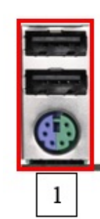

# Tarea
Practica18
## CONECTORES
- Puertos USB 2.0 y conector PS/2

Estos puertos USB 2.0 (negros) se usan para conectar periféricos básicos como teclados, ratones, impresoras o memorias USB.
El conector redondo PS/2 (verde/morado) es un puerto heredado que permite conectar teclados o ratones antiguos que no usan USB.

