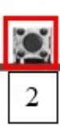

Practica18
## CONECTORES
- Puertos USB 2.0 y conector PS/2

Estos puertos USB 2.0 (negros) se usan para conectar periféricos básicos como teclados, ratones, impresoras o memorias USB.
El conector redondo PS/2 (verde/morado) es un puerto heredado que permite conectar teclados o ratones antiguos que no usan USB.
- Botón “Clear CMOS”

  

  Este botón sirve para restablecer la configuración del BIOS/UEFI a sus valores predeterminados de fábrica.
Se utiliza cuando el sistema presenta errores de arranque o configuraciones incorrectas del BIOS.
- Puerto DisplayPort

El DisplayPort transmite señal de video y audio digital de alta calidad.
Se usa para conectar monitores modernos, ofreciendo resoluciones 4K o superiores con gran frecuencia de actualización.
