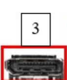

Practica18
## CONECTORES
- Puertos USB 2.0 y conector PS/2

Estos puertos USB 2.0 (negros) se usan para conectar periféricos básicos como teclados, ratones, impresoras o memorias USB.
El conector redondo PS/2 (verde/morado) es un puerto heredado que permite conectar teclados o ratones antiguos que no usan USB.
- Botón “Clear CMOS”

  

  Este botón sirve para restablecer la configuración del BIOS/UEFI a sus valores predeterminados de fábrica.
Se utiliza cuando el sistema presenta errores de arranque o configuraciones incorrectas del BIOS.
- Puerto DisplayPort

El DisplayPort transmite señal de video y audio digital de alta calidad.
Se usa para conectar monitores modernos, ofreciendo resoluciones 4K o superiores con gran frecuencia de actualización.

- Puerto HDMI

El conector HDMI (High Definition Multimedia Interface) transmite audio y video digital a través de un solo cable.
Es el más común para conectar monitores, televisores o proyectores.

- Puerto Serial (COM)

Es un puerto RS-232, usado principalmente para comunicación con dispositivos industriales, routers, equipos médicos o sistemas de automatización.
Aunque está en desuso en PCs modernas, aún es útil para tareas de mantenimiento o diagnóstico.

- Puerto DVI (Digital Visual Interface)

   
El DVI transmite señales de video digital (y a veces analógica).
Se usa para conectar monitores de computadora y ofrece buena calidad de imagen, aunque ha sido reemplazado en gran medida por HDMI y DisplayPort.

- Puerto VGA (Video Graphics Array)

El VGA transmite video analógico.
Fue el estándar durante muchos años, pero actualmente está en desuso por su menor calidad comparada con los conectores digitales.

- Puertos USB 3.0 / 3.1 (azules)

Estos puertos ofrecen mayor velocidad de transferencia (hasta 5 o 10 Gbps según la versión).
Son ideales para discos duros externos, memorias USB rápidas y otros dispositivos que requieren gran ancho de banda.

- Puertos eSATA / USB combinados (rojos)

Permiten conectar discos duros externos eSATA o dispositivos USB.
El eSATA ofrece velocidades similares a las de los discos internos, útil para copias de seguridad o almacenamiento externo de alto rendimiento.

- Puerto Ethernet (RJ-45)

Este conector se utiliza para la conexión a redes cableadas (LAN o Internet) mediante un cable de red.
Debajo de él se encuentran puertos USB 3.0 adicionales.

- Conectores de audio (panel de sonido)

**Estos conectores de 3.5 mm permiten la conexión de altavoces, micrófonos y sistemas de audio envolvente (5.1 o 7.1).**

Verde: salida de altavoces frontales

Naranja: altavoces centrales/subwoofer

Negro: altavoces traseros

Azul: entrada de línea

Rosa: micrófono

Gris: salida lateral (en configuraciones 7.1)
También hay un conector óptico S/PDIF (negro cuadrado) para audio digital de alta fidelidad.

